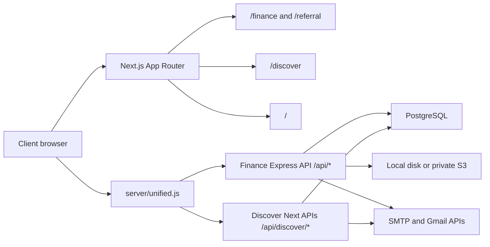

# Setu Systems Architecture

## Architecture Goal

Setu Systems consolidates Finance, Referral, and Discovery into one production-grade product family. The system is optimized for a low-cost AWS start, while keeping clear boundaries for client-facing scale, auditability, and later service separation.

## Runtime Shape

## Code Boundaries

| Area | Location | Responsibility |
| --- | --- | --- |
| Unified server | `server/unified.js` | Prepares Next, prepares Finance services, mounts Discover API namespace, and runs one HTTP listener. |
| Finance API | `server/index.js`, `server/stateStore.js`, `server/db/` | Auth, Finance state, customers, invoices, payments, payables, contracts, audit events, referrals, feedback, and provider status. |
| Finance UI | `src/App.jsx`, `src/styles.css`, `src/app/finance/`, `src/app/referral/` | Finance portal, referral public portal, and legacy referral compatibility routes. |
| Discover UI/API | `src/components/SetuDiscoverPortal.tsx`, `src/app/discover/`, `src/app/api/` | Discovery portal, source registry, ingestion, matching, review queue, email log, and Discover auth. |
| Shared data | `DATABASE_URL` | One PostgreSQL database with Finance and Discover schemas side-by-side. |
| Product docs | `docs/`, `docs/discover/`, `files/` | Finance and Discover inherited artifacts plus Setu Systems controlling docs. |

## Routing Model

| Route | Handler |
| --- | --- |
| `/` | Next landing page |
| `/finance`, `/finance/*` | Next route rendering the Finance React portal |
| `/referral`, `/referral/*` | Next route rendering the Finance referral portal |
| `/refer`, `/refer/*` | Legacy referral route rendering the referral portal |
| `/discover`, `/discover/*` | Next route rendering the Discovery portal |
| `/api/*` | Finance Express API |
| `/api/discover/*` | Discover API namespace, rewritten internally to Next route handlers |

## Data Model Strategy

The first production deployment should use one RDS or Aurora PostgreSQL database. This keeps cost low and simplifies backup, monitoring, migration order, and local parity. Finance and Discover remain logically separate through table naming and repository/API boundaries.

Recommended later split points:

- Separate Discover ingestion workers if scheduled crawling grows.
- Separate document processing queues if contract parsing or PDF generation becomes high volume.
- Separate read replicas if portal reads outgrow the primary database.
- Add tenant/workspace scoping before broad multi-client production rollout.

## Production Principles

- Keep Finance payment and amount data inside Finance APIs.
- Let Discover consume only status-level engagement flags through `/api/integration/engagement-status`.
- Store secrets in AWS Secrets Manager or SSM Parameter Store, never in repo files.
- Store generated contracts, receipts, and payslips in a private S3 bucket for production.
- Run all schema setup through versioned commands before deployment traffic cutover.
- Use one branded Setu wordmark across portals with portal labels underneath.
