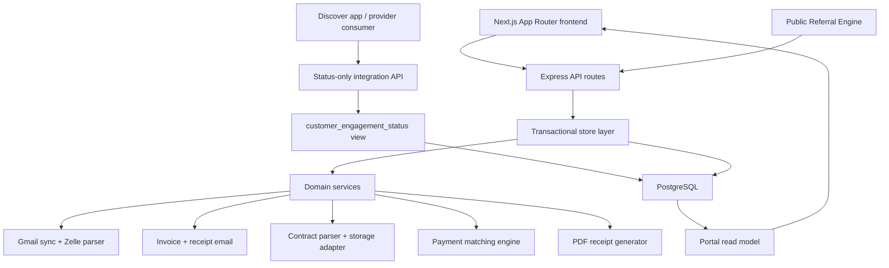
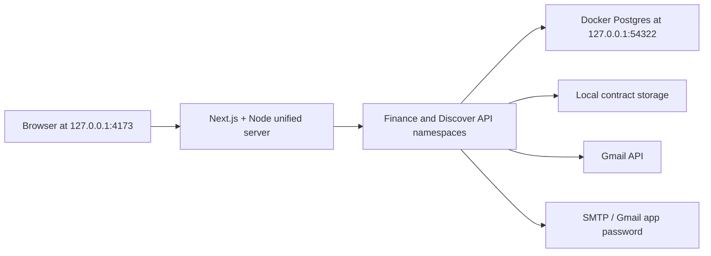
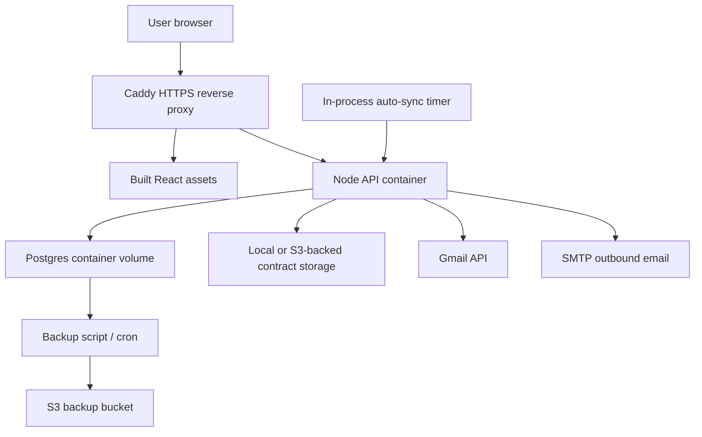
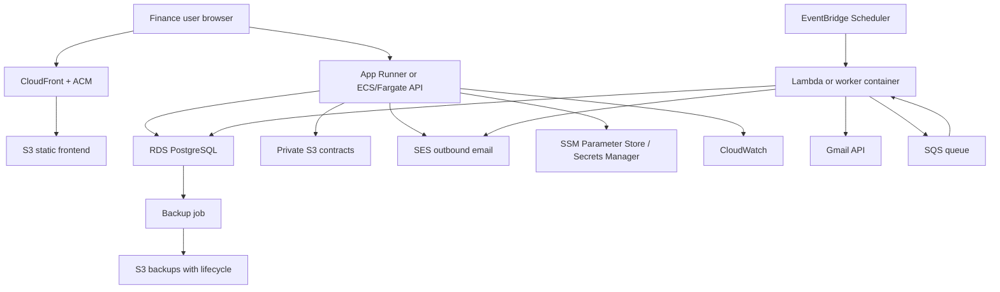

# Setu Finance Architecture Document

## 1. Architecture Summary

Setu Finance is a React + Node/Express + PostgreSQL product foundation for contract-first finance operations. The architecture separates user experience, API orchestration, domain services, persistence, integrations, and cloud storage concerns so the current internal portal can grow into a broader product suite.

The current local and AWS deployments run the same application code. The local stack uses Next.js, the unified Node server, and local Docker Postgres. The AWS dev stack currently runs Docker containers on EC2 with Caddy, Node API, and PostgreSQL. The recommended production target evolves this into managed AWS services such as CloudFront, S3, App Runner or ECS/Fargate, RDS PostgreSQL, S3 contract storage, SES, EventBridge, SQS, Lambda workers, Parameter Store/Secrets Manager, and CloudWatch.

## 2. Logical Layers

## 3. Layer Responsibilities

| Layer | Main files | Responsibility |
| --- | --- | --- |
| Frontend | `src/App.jsx`, `src/lib/*`, `src/styles.css` | Operator UI, public Referral Engine and feedback forms, route-based navigation, modal workflows, dashboard/chart presentation, customer 360, billing console, referral admin, People, Payables, settings. |
| API | `server/index.js` | Auth middleware, HTTP routes, request validation boundary, integration wiring for invoice/receipt email and Gmail sync. |
| Provider integration API | `server/routes/integration.js`, `server/integration/engagementStore.js` | Machine-to-machine, API-key-protected, read-only engagement status endpoint for downstream apps. |
| Store / application service | `server/stateStore.js` | Transactional business operations, read-model hydration, customer/invoice/payment/referral writes, exception history, manual payment application. |
| Domain services | `server/services/*` | Gmail parsing, matching, email templates, receipt PDF, contract parsing, contract storage, auth helpers, sync settings, auth audit logging. |
| Database runtime | `server/db/*` | Connection pooling, migrations, seed/bootstrap, normalization helpers. |
| Shared catalog | `shared/*` | Shared service catalog and numeric ID helpers used by frontend and backend. |
| Documentation/artifacts | `docs/*`, `files/*` | Requirements, process flows, architecture, pitch artifacts, clickable wireframes. |

### Global Search Layer

The current portal uses a low-cost deterministic search index generated in the React shell from the already-loaded read model. This supports Workday-style quick navigation without adding infrastructure cost.

| Search category | Current source | Destination |
| --- | --- | --- |
| Pages and tasks | Static finance route catalog | Dashboard, Clients, Receivables tabs, Payables, Referrals, People, Contracts, Settings, Audit, public referral, and feedback forms |
| Customers | Customer read model | Customer 360 routes |
| People | Employee read model | Employee 360 routes |
| Finance records | Invoice and payment read model | Receivables tabs |
| Contracts | Contract read model | Contracts workspace, signed-with/search metadata, protected quick preview, and protected download routes |
| Referrals and feedback | Admin referral/feedback queues | Referrals workspace |

Search is intentionally side-effect free. It can redirect a user to `Inbox sync`, `Invoices`, or `Payments to confirm`, but it does not automatically run Gmail sync, create invoices, apply payments, or send receipts.

Future AWS growth path:

- Keep deterministic in-browser search for small internal teams because it has no extra AWS cost.
- Add endpoint-specific search APIs when the read model becomes too large to hydrate fully.
- Use PostgreSQL full-text search and indexed normalized fields before introducing a separate search service.
- Add RAG only for knowledge-heavy queries such as contract clause lookup, policy lookup, or natural-language analytics. A low-cost AWS version can use S3 for source documents, PostgreSQL `pgvector` or OpenSearch Serverless for embeddings, and Bedrock or an approved LLM provider only when admins enable it.

### V2 Shell Mapping

The current local frontend uses a Setu portal-family shell plus the merged v2 finance information architecture while preserving the original operational routes and backend contracts.

| Surface | Live implementation |
| --- | --- |
| Portal landing | `/` is a public landing page with the shared bridge wordmark, one-bar portal switcher, and five portal cards. Finance and Referral are active; Discover, Customer, and Media are visible as future suite surfaces. |
| Executive | Existing dashboard read model at `/dashboard`. |
| Clients | New `/clients` hub plus existing `/onboarding`, `/customers`, and `/customers/:id`. |
| Receivables | New `/receivables` alias around the existing billing console; `/billing` remains valid. The frontend presents the same APIs through tabs for overview, invoices, payment review, exceptions, receipts, and inbox sync. |
| Payables | Money-out hub for employee payments, employee referral payouts, Other paid expenses, Other received income/refunds, region reporting, and customer invoice-discount visibility. |
| Referrals | New `/referrals` alias around the Referral Program admin workspace; includes Referral Engine intake review, legacy referral submissions, relationship tracking, rewards, feedback, and event history. `/admin` remains valid. |
| People | Employee system of record plus normalized referral parties; supports employee onboarding, compensation fields, status, HR notes, payment history, employee contract upload, and payslip PDF generation/download. |
| Contracts | Searchable authenticated contract archive for client onboarding files and employee HR files, showing signed-with party, short summary, signed date, protected inline quick preview, protected download links, and S3-ready categorized storage keys. |
| Settings | Existing settings, including Gmail sync automation and referral-program config. |
| Audit | New hub reading existing activity, resolved exception history, and structured referral events. |

## 4. Runtime Deployment Views

### Local Development

### Current AWS Dev

### Recommended Production AWS

## 5. Core Data Domains

| Domain | Tables / records | Notes |
| --- | --- | --- |
| Customer identity | `customers`, `customer_emails`, `customer_phones`, `customer_aliases`, `customer_profiles` | Stable customer ID, contact search, aliases, onboarding state, address, billing preferences. |
| Service enrollment | `customer_service_enrollments`, legacy service tables | Timestamped services support future add-ons and historical service review. |
| Contracts | `customer_contracts`, `business_contracts` | Client contract metadata and employee/stakeholder contract metadata, parsed fields where available, signed-with party, compact summary, signed date, owner/category/type labels, storage provider/key, protected quick preview, and protected downloads from customer 360, employee 360, and Contracts. |
| Invoices | `invoices`, `invoice_reward_applications` | Draft/sent/paid/overdue status, numeric invoice codes, referral discounts. |
| Payments | `payments`, `processed_messages` | Confirm queue, confirmed ledger, source provider, transaction reference, receipt status, duplicate guards. |
| Exceptions | `exceptions`, `exception_candidates`, `exception_resolution_history` | Open review queue plus durable action history with actor and customer/payment resolution. |
| Referral Engine | `referral_intake`, `referral_intake_services`, `referral_intake_events` | No-login referral intake for customers, employees, and manually reviewed referrers; finance approval gate; duplicate/self-referral controls; service-based reward estimate. |
| Referrals | `referral_parties`, `customer_referrals`, `customer_reward_ledger`, `referral_submissions`, `referral_events`, `referral_payouts` | Party-normalized referrers, referral codes, legitimacy review status, reward qualification, customer invoice-discount application, employee payout seam. |
| People | `employees`, `employee_payments`, `employee_payslips`, `business_contracts` | Employee identity, status, HR comments, compensation fields, region, payment history, generated payslip PDFs, and uploaded HR contract files used by Referral Engine, Payables, and Contracts. |
| Other expenses | `other_expenses` | Operating expenses and received income/refunds with category, region, department, vendor/source, memo, and reference. |
| Feedback | `feedback_submissions` | Public feedback intake, optional attachment metadata, admin review/archive state. |
| Integrations/settings | `integration_states`, `system_settings` | Gmail sync state, auto-sync settings, referral program rules. |
| Provider status view | `customer_engagement_status` | Status-only derived view for downstream apps; selects customer ID, primary email, engagement status, and timestamp only. |
| Auth audit | `auth_audit_events` | Low-cost login/logout/API-key audit trail with safe metadata, hashed IP, and hashed user-agent. |
| Dashboard | `dashboard_snapshots`, `dashboard_aging_buckets`, `dashboard_collection_series` | Current projection storage and future analytics seam. |
| System | `app_sequences`, `activity_events`, `schema_migrations` | Numeric ID sequencing, audit timeline, migration tracking. |

## 6. Business Transaction Boundaries

| Operation | Transaction guarantee |
| --- | --- |
| Onboarding | Customer, contact, service, contract metadata, generated invoices, and referral linkage save together. |
| Invoice creation | Customer service update if needed, invoice insert, optional email send, and activity event are coordinated. |
| Gmail sync apply | Processed message IDs, payment records, exceptions, and sync state are stored idempotently. |
| Payment apply | Duplicate/replay checks, invoice update, payment confirmation, referral qualification, and activity write happen in one database transaction. |
| Manual payment | Manual payment insert and apply happen together; if replay risk is detected the payment moves to exception instead of confirmed ledger. |
| Exception resolution | Exception status, payment movement, customer assignment, history row, and activity event are preserved together. |
| Referral bonus apply | Invoice discount, reward ledger status, referral status, and activity event update together. |
| Referral Engine submit | Public referral intake header, services, dedupe/self-referral checks, reward snapshot, event row, and activity row save together. |
| Referral Engine review | Identity resolution, approve/reject status, relationship creation when possible, event row, and activity row save together. |
| Referral Engine qualify | Customer invoice-discount reward or employee referral payout is created in the same transaction as the qualified status update. |
| Referral intake/party link | Public referral submissions and customer onboarding preserve the legacy referrer customer ID while also stamping the normalized referrer party ID. |
| Employee onboarding/payment | Employee master record and employee payment records are written as separate auditable transactions; payments remain visible from employee 360 and Payables. |
| Employee contract upload | Employee identity lookup, binary storage, `business_contracts` metadata, and activity event are coordinated so uploaded HR files are immediately searchable in the Contracts archive. |
| Payslip generation/download | Payslip metadata is generated from recorded employee payments; PDF download is produced from current employee and payslip records without exposing the file through unauthenticated routes. |
| Other expense entry | Other paid/received entry and activity event write together, including exact cents and region/category reporting fields. |
| Feedback submit/review | Feedback records are stored independently, attachment payloads stay out of main read-model state, and review/archive actions preserve actor and timestamp. |

## 7. Payment Integrity Design

- `processed_messages` prevents reprocessing the same Gmail message as new money.
- Confirmed invoice payments are guarded so the same invoice cannot be counted twice.
- Zelle transaction references are unique across Gmail, Zelle, and manually verified Zelle scopes.
- Reused Zelle references become possible abuse/replay exceptions, not accepted payments.
- Manual payments are source-labeled and preserve route/reference/memo/internal notes.
- Duplicate, archived, or replay-risk records stay out of received totals.
- Payment application and receipt sending are separate to avoid email failure rolling back ledger truth.

## 8. Performance And Cost Choices

- PostgreSQL is normalized for customer, invoice, payment, and referral reuse.
- High-value lookup columns are indexed, including normalized names, normalized emails, phone last 4, invoice status/due date, payment review status, exception status, and transaction reference.
- Portal read-model hydration is acceptable for current internal scale and gives a simple UI contract.
- As volume grows, read APIs should become endpoint-specific and cursor-based.
- JSONB is used only for sparse integration state and parsed payloads.
- Contract storage is abstracted so local filesystem can become private S3 without changing the portal workflow.
- Contract quick preview streams through the authenticated API and storage adapter, so S3 objects can remain private.
- Global navigation search is generated from the current read model and route catalog, avoiding OpenSearch or vector database costs at the current stage.
- Current AWS dev favors EC2 Docker simplicity. Production should prefer managed RDS and managed frontend/static delivery for lower operational risk.

## 9. Security And Compliance Posture

- Admin portal requires authentication.
- Provider integration endpoints require `X-Api-Key` and `INTEGRATION_API_KEY`; portal sessions do not grant access to integration data.
- Runtime secrets must stay in `.env`, SSM Parameter Store, or Secrets Manager, never committed to Git.
- Engagement status integration responses must not expose amounts, balances, invoice rows, payment rows, memos, or raw transaction content.
- Auth audit logging must never store passwords, API-key values, session cookies, OAuth tokens, SMTP passwords, MFA codes, raw IP addresses, or raw user-agent strings.
- Uploaded contracts should be private and encrypted.
- Receipt email must go to the primary customer email from the database.
- Exception and payment decisions preserve actor and timestamp.
- Reused Zelle transaction references are treated as risk events.
- Cloud logs should be centralized in CloudWatch.
- Database backups should run every 2 hours with S3 lifecycle transition to low-cost storage.

## 10. Growth Path

1. Add `organizations` and `workspaces` to introduce tenant scoping.
2. Split `stateStore.js` into customer, invoice, payment, referral, contract, and settings modules.
3. Move Gmail sync, receipt sending, invoice sending, and backups to queue-backed workers.
4. Add a search API for customer and invoice lookup instead of full-state client search.
5. Move production Postgres to RDS with automated snapshots and optional point-in-time recovery.
6. Add Cognito or an enterprise identity provider when external users or multiple roles expand.
7. Add bank API integration behind the same payment event model.
8. Add analytics projections or a warehouse only after real reporting volume requires it.
