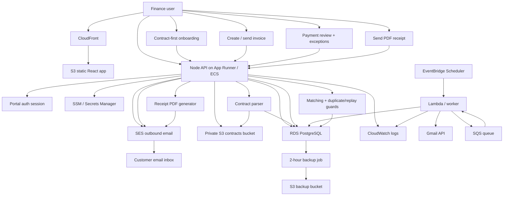
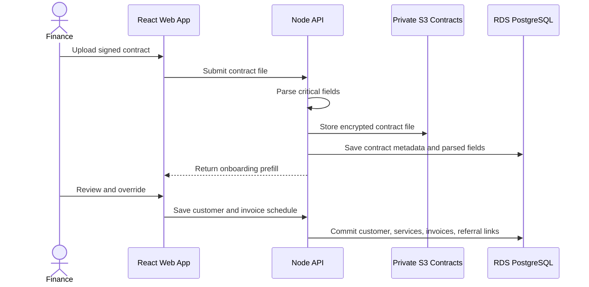
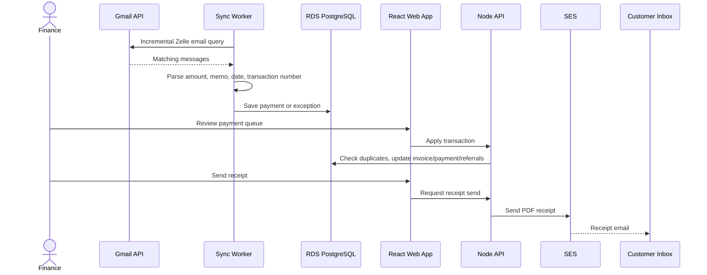

# Setu Finance AWS Solution Architecture

This document explains how Setu Finance should run on AWS with a low-cost, suite-ready stack. It includes the user flow, AWS service mapping, and a legend that explains each component in one line.

## 1. Architecture Goals

- Keep early monthly costs low.
- Preserve the current React + Node/Express + PostgreSQL application shape.
- Support secure contracts, invoices, Gmail/Zelle sync, manual payment entry, receipts, and referral tracking.
- Avoid unnecessary services such as Kubernetes, Redis, or a data warehouse until scale requires them.
- Keep a clean path from current internal portal to future product suite.
- Make backups simple and frequent enough to minimize data-loss windows.

## 2. Current AWS Dev Stack

The current AWS dev environment is intentionally simple:

| Runtime piece | Current AWS dev implementation |
| --- | --- |
| Compute | EC2 instance |
| Reverse proxy / HTTPS | Caddy container |
| Frontend | Next.js standalone server behind the web edge |
| API | Node/Express Docker container |
| Database | PostgreSQL Docker container with persistent volume |
| Gmail sync | In-process scheduler plus manual sync button |
| Outbound email | SMTP from configured Gmail/app-password account |
| Backups | Scriptable PostgreSQL dump path to S3 |

This is acceptable for dev/non-prod and very low-cost testing. Production should move the database and storage responsibilities to managed AWS services.

## 3. Recommended Production AWS Stack

| Layer | AWS service | Function | Cost posture |
| --- | --- | --- | --- |
| DNS and TLS | Route 53 + ACM | Domain routing and managed HTTPS certificates | Low |
| Unified web runtime | App Runner or ECS Fargate | Serve Next.js portal family | Low |
| API runtime | App Runner or ECS/Fargate | Run existing Node/Express API without rewriting into serverless functions | Low to moderate |
| Database | RDS PostgreSQL | Managed system of record with snapshots and point-in-time recovery option | Main fixed cost |
| Contract storage | Private S3 bucket | Encrypted client/employee contract files by owner category, owner ID, and date; preview/download streams through API | Usage-based |
| Backups | S3 backup bucket + lifecycle rules | Store 2-hour PostgreSQL backups and transition older objects to cheaper classes | Low |
| Queue | SQS | Decouple sync/email/reconciliation work from user requests | Usage-based |
| Scheduled jobs | EventBridge Scheduler | Trigger Gmail sync and backups on schedule | Very low |
| Workers | Lambda or Fargate scheduled task | Run Gmail sync, reconciliation, receipt jobs, future bank jobs | Usage-based |
| Email | SES | Send invoice and receipt emails | Very low at early volume |
| Secrets | SSM Parameter Store / Secrets Manager | Store database password, Gmail token, SMTP/SES credentials, auth secret | Low |
| Observability | CloudWatch | Logs, alarms, basic operational visibility | Usage-based |

## 4. User Flow With AWS Touchpoints

## 5. Legend

| Component | One-line function |
| --- | --- |
| Finance user | Internal operator who performs onboarding, billing, review, receipts, and reporting. |
| CloudFront | Secure global entry point for loading the frontend quickly over HTTPS. |
| S3 static React app | Stores the compiled web application without running a web server. |
| Node API on App Runner / ECS | Runs authentication, business rules, matching, payments, receipts, settings, and admin APIs. |
| Portal auth session | Protects finance data and keeps users signed in during operational work. |
| RDS PostgreSQL | Durable system of record for customers, contracts, invoices, payments, exceptions, referrals, settings, and audit history. |
| Private S3 contracts bucket | Encrypted storage for uploaded contracts organized by owner category, owner ID, and date; files remain private while preview/download streams through the authenticated API. |
| SES outbound email | Sends invoice emails and PDF receipt emails at low cost. |
| SSM / Secrets Manager | Holds runtime secrets outside code and Git. |
| CloudWatch logs | Central place to review API, worker, sync, and error logs. |
| Contract parser | Extracts services, fees, installments, dates, and critical fields from uploaded agreements. |
| EventBridge Scheduler | Runs timed jobs such as Gmail sync and backups without a person clicking a button. |
| Lambda / worker | Executes background sync, reconciliation, and future bank-integration tasks. |
| Gmail API | Reads Zelle confirmation emails from the configured mailbox. |
| SQS queue | Buffers background jobs so user requests stay fast and reliable. |
| Matching + duplicate/replay guards | Assigns payments to customers and blocks duplicate or reused Zelle transaction numbers. |
| Receipt PDF generator | Creates the customer-facing payment confirmation attachment. |
| Customer email inbox | Receives invoice and receipt emails from Setu Finance. |
| 2-hour backup job | Creates regular database backups to reduce possible data loss. |
| S3 backup bucket | Stores backups with lifecycle transition to low-cost archive storage. |

## 6. Recommended Data Flow

### Contract And Onboarding

### Payment And Receipt

## 7. Backup And Data Retention

| Requirement | AWS implementation |
| --- | --- |
| Minimize data loss | Run database backup every 2 hours. |
| Keep cost low | Store backups in S3 and use lifecycle transition to Glacier Instant Retrieval or Glacier Flexible Retrieval for older backups. |
| Protect sensitive data | Encrypt S3 buckets and block public access. |
| Restore path | Keep a documented restore script that can hydrate a new PostgreSQL database from the latest backup. |
| Dev flexibility | Current EC2 dev stack can use containerized Postgres, but production should use RDS snapshots plus logical dumps. |

## 8. Security Controls

- Use HTTPS everywhere through ACM/CloudFront or Caddy-managed TLS.
- Keep Gmail OAuth tokens, SMTP/SES credentials, portal password, database password, and auth secret in managed secrets.
- Block public access to contract and backup S3 buckets.
- Use least-privilege IAM for contract storage, backup writes, SES send, and secret reads.
- Preserve exception, payment, referral, and receipt activity history.
- Treat reused Zelle transaction numbers as possible replay/abuse risk.

## 9. Low-Cost Deployment Recommendation

### Non-Production

- Continue using a single small EC2 instance with Docker for API, Caddy, and Postgres.
- Use S3 for backups and optionally contracts.
- Keep Gmail sync in-process if traffic is low.
- Keep manual operator access limited.

### Production

- Use S3 + CloudFront for frontend.
- Use App Runner or ECS/Fargate for API.
- Use RDS PostgreSQL single-AZ at first.
- Use S3 private buckets for contracts and backups.
- Use EventBridge + SQS + Lambda/worker for Gmail sync and background processing.
- Use SES for outbound invoice and receipt email.
- Add CloudWatch alarms for API health, worker failures, backup failures, and sync failures.

## 10. Growth Path

1. Start with low-cost managed production services.
2. Add tenant/organization scoping before onboarding multiple businesses.
3. Move Gmail sync from API timer to EventBridge + worker.
4. Add bank API integrations as new payment-event sources.
5. Add worker outbox table for reliable email and receipt delivery.
6. Add analytics projections or a warehouse only after leadership reporting requires it.
