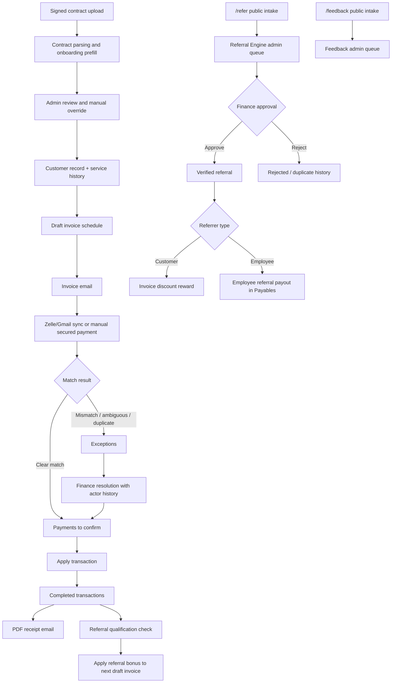

# Setu Finance Current State

Last updated: June 7, 2026

This document is the consolidated current-state handoff for the Setu Finance portal. It is written for business, finance, operations, and technical reviewers who need to understand what the portal does today.

## 1. Live Access

| Environment | URL | Purpose |
| --- | --- | --- |
| Local development | `http://127.0.0.1:4173/` | Local developer/operator testing. |
| AWS dev primary | `https://3.135.234.59.sslip.io/` | Current externally reachable dev portal. |
| AWS dev recovery | `https://18.218.196.158.sslip.io/` | Recovery/backup dev endpoint. |
| Public referral form | `/refer` | No-login Referral Engine intake for customers, employees, and manually reviewed referrers. |
| Public referral gateway | `/refer/:code`, `/referral-gateway/:code`, `/r/:code` | No-login referral gateway. Employee IDs can prefill the employee path; finance review is still required before reward routing. |
| Public feedback form | `/feedback` | No-login feedback intake with optional attachments. |
| Provider engagement status API | `/api/integration/engagement-status` | Machine-to-machine read-only engagement status for downstream apps, protected by `X-Api-Key`. |

Security note: real passwords, OAuth tokens, SMTP passwords, and customer-sensitive secrets are not stored in documentation. Portal credentials are configured through environment variables or cloud secret storage.

## 2. Product Purpose

Setu Finance is an internal finance operations portal for contract-first client onboarding, invoice generation, payment capture, human payment review, receipt generation, customer 360 visibility, referral reward management, and feedback intake.

The portal is intentionally designed as a product-suite foundation. Customer identity, contracts, services, invoices, payments, referrals, feedback, settings, and audit history are stored as durable records instead of temporary spreadsheet rows.

Setu Finance also exposes a provider-side status-only integration for downstream applications. The integration returns engagement status derived from invoice regularity and deliberately excludes amounts, balances, invoice line items, payment memos, and raw transaction details.

Authentication/security audit logging is stored in PostgreSQL for low-cost local and AWS operation. Login, logout, and provider API-key events are visible from the Audit workspace without storing passwords, API keys, tokens, raw IP addresses, or raw user-agent strings.

## 3. Primary Users

| User | What they do in the portal |
| --- | --- |
| Finance operator | Onboard clients, upload contracts, create invoices, sync/review payments, resolve exceptions, send receipts. |
| Finance admin | Manage referral rules, Gmail sync settings, feedback queue, and operational configuration. |
| Leadership/business user | Review collections, outstanding work, referral performance, exceptions, and operational risk. |
| Customer/member | Submit referrals through `/refer` and submit feedback through `/feedback` without logging in. |
| Sales/employee referrer | Submits referrals through `/refer`; employee identity can resolve by employee ID, official email, personal email, official mobile, or personal mobile. |

## 4. Current Functional Map

## 5. Portal Navigation

| Area | Current purpose |
| --- | --- |
| `/` | Public Setu portal landing with the bridge wordmark, one-bar portal switcher, and five portal cards. Finance and Referral are live links; Discover, Customer, and Media are marked as coming soon. |
| Executive | Default summary landing page using the existing Dashboard route and read model. Legacy `/dashboard` still works. |
| Clients | Merged v2 section for contract-first onboarding, customer register, and customer 360 entry points. Existing `/onboarding`, `/customers`, and `/customers/:id` routes still work. |
| Receivables | Merged v2 section for the existing billing console. It now uses tabs for `Overview`, `Invoices`, `Payments to confirm`, `Exceptions`, `Receipts`, and `Inbox sync`, while preserving invoice sending, Zelle sync, payment review, exception resolution, manual payments, completed transactions, and receipt actions. Existing `/billing` still works. |
| Payables | Money-out workspace for employee payments, employee referral payouts, other paid expenses, other received income/refunds, region-level distribution, and existing customer invoice-discount visibility. |
| Referrals | Merged v2 section for referral rules, Referral Engine intake review, legacy customer referral submissions, relationship tracking, reward qualification, invoice-discount application, feedback queue, parties, codes, and event history. Existing `/admin` still works. |
| People | Employee system of record for onboarding employees, employee status, HR comments, compensation fields, employee payment history, and referral-party visibility. |
| Contracts | Authenticated contract archive for client, employee, NDA, offer letter, stakeholder, and HR agreement files. Rows show category, signed-with party, short summary, signed date, Quick peek, and Download. |
| Settings | Gmail auto-sync settings, outbound email status, access, and referral-program configuration. Existing Gmail credentials and token paths are not changed by the v2 shell. |
| Audit | New v2 hub combining activity history, resolved exception history, and structured referral events. |
| `/refer` | Public no-login referral submission form. |
| `/refer/:customerId` | Personalized referral gateway for a specific referrer. The customer ID is prefilled from the URL and the email is still verified before finance can convert the submission. |
| `/feedback` | Public no-login feedback submission form with optional attachments. |

Global navigation search:

- The authenticated finance shell now includes a Workday-style global search bar in the top header.
- Search suggestions are grouped by category, including pages, tasks, customers, people, finance records, referrals, and feedback.
- Users can search by page name, task keyword, customer ID, customer name, email, phone, alias, employee ID, employee name, employee email, invoice number, transaction reference, referral code, or feedback context.
- Search results deeplink into the appropriate route, including customer 360 and employee 360 pages.
- Search supports first-three-letter matching for quick task discovery, similar to Workday-style search behavior.
- Search is side-effect free: selecting `Sync Zelle inbox`, `Create invoice`, or `Record manual payment` navigates to the correct workspace/tab but does not automatically sync, apply money, or create records.

Setu portal-family naming:

| Portal | Tagline | Status |
| --- | --- | --- |
| Finance | Finance operations | Live |
| Discover | Discovery operations | Coming soon |
| Customer | Customer portal | Coming soon |
| Media | Media portal | Coming soon |
| Referral | Referral operations | Live |

## 6. Client Onboarding

Current onboarding starts with contracts.

- Upload one or more signed contracts.
- Parse contract files for services, fee, installments, billing cadence, service start date, and contact hints.
- Allow admins to manually override all extracted fields.
- Require first name, last name, primary email, primary phone, and at least one service.
- Capture optional home address, referral source, billing notes, and Zelle identity hints.
- Support one-time and recurring fees.
- Generate invoice schedule rows from contract terms when available.
- Store uploaded contract metadata and make contracts visible from customer 360.

## 7. Customer Records And 360 View

Customers use stable numeric 6-digit customer codes.

The customer search experience supports lookup by:

- customer ID
- first name
- last name
- email
- phone
- alias
- invoice reference

The customer 360 page shows:

- signup and onboarding details
- emails, phones, and address
- enrolled services and service history
- contracts and contract-derived critical fields
- invoice ledger
- payment ledger
- open and resolved exceptions
- referrals made and referral source
- rewards and invoice-discount history

## 8. Invoicing

The tabbed Receivables workspace supports:

- new invoice creation for existing customers
- customer search during invoice creation
- customer-specific service selection
- custom service fallback
- draft and sent invoice states
- numeric invoice numbers
- invoice email sending
- Zelle payment instructions
- card payment URL support when configured
- referral bonus discounts on invoices

Referral rewards reduce invoice amounts. The current customer referral model does not issue direct cash credits.

## 9. Payment Capture

Setu Finance supports two payment intake paths.

Gmail/Zelle sync:

- Reads Gmail through OAuth.
- Filters to relevant Zelle confirmation emails.
- Stores Gmail message IDs to avoid reprocessing.
- Uses incremental sync with overlap.
- Captures exact cents, transaction number, sent date, memo, sender name, message sender, message recipient, raw extracted text, and parsed payload.
- Supports admin-configurable auto-sync interval, currently designed for every 5 minutes.
- If Google returns `invalid_grant`, manual sync stays inside the portal session and shows a reauthorization instruction to run `npm run gmail:authorize`.

Exception review:

- Open exceptions show explicit `Approve`, `Review`, and `Reject` actions.
- Approved valid exceptions can be applied directly or assigned to a customer first.
- Rejected exceptions move to a visible archived bucket and are not counted or applied.
- Archived bucket deletion requires a checkbox, typing `DELETE`, and a reason; the row is soft-deleted and audit history remains.

Manual secured payment:

- Used only after funds are verified outside Gmail sync.
- Supports manually verified Zelle, bank transfer, check, cash, card processor, or other secured route.
- Captures amount, date, route, transaction/reference, memo, invoice link, and internal verification note.

## 10. Matching And Exceptions

The matching engine uses deterministic signals:

- customer names
- aliases
- emails
- phone hints
- invoice amounts
- transaction references
- invoice/customer context

Clear matches go to `Payments to confirm`. Unclear or risky payments go to `Exceptions`.

Exception handling supports:

- assign transaction to an existing customer
- save alias for future matching
- move valid matched transactions forward for finance apply
- accept valid non-duplicate linked transactions
- archive duplicates
- preserve exception history with action, actor, timestamp, resolved customer, and resolved payment

Same Zelle transaction-number reuse is blocked and treated as possible replay/abuse risk.

## 11. Payment Application And Receipts

Payment application is human-controlled.

- Finance reviews and applies a payment.
- Applying updates the payment, invoice, customer 360, dashboard, activity, and referral qualification state.
- Sending a receipt is a separate action.
- Completed transactions include receipt status.
- Receipts can be sent or re-sent.
- Receipt email includes a PDF attachment.

Receipt PDF includes:

- customer name
- customer ID
- amount received
- payment date
- transaction/reference number
- memo
- invoice reference when available
- receipt issued timestamp

## 12. Referral Engine

The public Referral Engine is available at `/refer` and does not require login.

The current engine supports:

- referrer identity by email, phone, or employee ID
- email and phone search across employee and customer records
- employee ID search against employee records only
- manual self-declared referrers for finance identity resolution
- service selection using the referral service catalog
- required relationship/channel selection
- duplicate detection by referred client email or phone
- self-referral blocking
- server-authoritative reward calculation
- finance admin review before any relationship or reward is established

Reward routing:

- Employee referrers earn a cash-bonus estimate, capped by the configured referral service rules, and qualified rewards appear as referral payouts in Payables.
- Customer referrers earn invoice-discount rewards that apply to future eligible draft invoices.
- Manually entered referrers stay `pending_identity` until finance resolves the identity to a customer or employee.

Finance admin states:

- `pending_identity`: finance must resolve the referrer to an employee or customer, or reject.
- `pending_review`: finance must approve or reject legitimacy.
- `verified`: approved, but not yet qualified for payout/discount routing.
- `qualified`: reward has been created in the correct destination.
- `duplicate` or `rejected`: retained as closed history.

## 13. People And Payables

People now stores employee records separately from customer records.

The People landing page is grouped into:

- `Employee Directory`
- `Onboard Employee`
- separate `Former Employees` table

Employee records include:

- employee ID
- first, middle, last, and preferred names
- personal and official email
- personal and official mobile
- title, department, region, manager
- status such as current, on leave, contractor, left company, or terminated
- joining and exit dates
- HR comments
- compensation fields for monthly salary, joining bonus, and annual bonus
- local currency based on region: US/USD, India/INR, Nigeria/NGN
- critical information notes
- employee payment history
- generated payslips by month or custom pay cycle

Employee Directory supports search by name, employee ID, email, phone, department, title, status, and region. It does not show the full employee population by default; results appear after search and are capped to the top 10 matches. Department, title, and region are controlled dropdowns. Employee 360 opens as `/people/:employeeId` and shows full employee information, payment transactions, payslips, uploaded employee contracts, and total referral count.

## 14. Contracts Archive

Contracts is a dedicated authenticated archive for files uploaded from client onboarding/customer 360 and People/employee 360.

Contracts rows show:

- `Contract`: file name, contract type, and file size
- `Category`: client, employee, stakeholder, or other
- `Signed with`: client/customer name for client contracts and employee name for employee contracts
- `Summary`: compact business summary derived from parsed contract fields or HR-upload notes
- `Signed date`: parsed/entered contract signed date when available
- actions: `Quick peek` and `Download`

Important behavior:

- `Quick peek` streams supported PDFs, images, and text files through the authenticated backend before any download.
- `Download` is the explicit action for the raw file.
- The UI no longer shows internal storage provider/uploader as a main table column.
- AWS deployments can keep contract files in private S3 because preview/download routes fetch through the backend storage adapter.

## 15. People And Payables Reporting

Payables now reports:

- employee payments by region
- employee referral payouts
- other expenses paid
- other income/refunds received
- operating expense distribution by region
- customer referral discounts that remain in Receivables as invoice discounts

## 16. Referral Program

Current state is finance-admin centric with public customer referral intake.

Supported today:

- public no-login `/refer` form
- duplicate prevention by referred email or phone for active submissions
- admin referral queue
- normalized referral-party foundation for client referrers, with room for employee, sales partner, and external partner referrers later
- unique referral codes on referral relationships, currently generated as `REF-YYYY-000001`
- legitimacy status fields for referral review: pending review, verified, rejected, or abuse flagged
- referral event history for key lifecycle actions such as grandfathered approval and reward accrual
- referral relationship tracking
- relationship label and referral date
- configurable referral program name, description, bonus amount, qualification paid amount, and qualification months
- historical rule snapshot per referral
- qualification after payment or time threshold
- green qualified reward queue
- one-click `Apply referral bonus`
- invoice discount application instead of direct credit
- reporting for tracked referrals, qualified referrals, and bonus spend

Current limitation:

- Phase 1 keeps the existing invoice-discount reward flow unchanged. Pending-review gating for new referrals is designed into the data model but not enforced in the current local build.
- Dedicated employee/sales/partner referral payout portal is not yet implemented.
- Employee/sales commissions and partner payouts should be modeled as a future `Referral Growth Portal` while Setu Finance remains the financial source of truth.

## 17. Feedback Intake

Setu Finance now includes a simple public feedback intake.

Users can open `/feedback` without logging in and submit:

- name
- email
- optional customer ID
- optional phone
- feedback category
- optional 1-5 rating
- feedback message
- up to 3 optional attachments

Admin review:

- feedback appears in the `Referral Program` workspace under `User feedback`
- admins can view metadata and open protected attachment links
- admins can mark feedback as reviewed or archive it
- engineering follow-up can be created in GitHub Issues later, but GitHub Issues are not the primary public intake channel

## 18. Settings And Integrations

Current settings include:

- Gmail auto-sync enable/disable
- Gmail auto-sync interval
- referral program rule configuration

Current integration points:

- Gmail OAuth for Zelle email sync
- SMTP/Gmail app password for invoice and receipt sending
- status-only provider API at `/api/integration/engagement-status`
- local filesystem contract storage in development
- S3-ready contract storage adapter for AWS
- PostgreSQL migrations for schema management

Security/auth audit:

- records login success, login failure, logout, and provider integration API-key success/failure
- stores event type, outcome, username when available, request method/path, safe metadata, timestamp, hashed IP, and hashed user-agent
- uses `AUTH_AUDIT_HASH_SALT` when configured, otherwise falls back to the session secret for local hashing
- never stores passwords, API-key values, OAuth tokens, SMTP passwords, MFA codes, session cookies, raw IPs, or raw user-agent strings

Provider engagement status:

- authenticated by `X-Api-Key` and `INTEGRATION_API_KEY`
- returns only `customer_id`, `email`, `engagement_status`, and `as_of`
- derives status from the `customer_engagement_status` database view
- default rule: no unpaid overdue invoices means `active`; overdue within 30 days means `dormant`; older overdue invoices mean `inactive`
- no amount columns are selected by the view or returned by the endpoint

## 19. Current Architecture

Current local stack:

- Next.js App Router frontend
- Express API backend
- PostgreSQL in Docker
- Gmail OAuth
- SMTP outbound email
- local contract storage

Current AWS dev stack:

- EC2
- Docker Compose
- Caddy HTTPS reverse proxy
- Node/Express API container
- PostgreSQL container with persistent volume
- same committed product code as local

Recommended production direction:

- S3 + CloudFront for frontend
- App Runner or ECS/Fargate for API
- RDS PostgreSQL for database
- private S3 for contracts and backups
- SES for outbound email
- EventBridge + worker for Gmail sync and backups
- SSM Parameter Store or Secrets Manager for secrets

## 20. Data Integrity And Safety Controls

Current controls:

- login required for finance data
- numeric customer IDs
- numeric invoice IDs
- processed Gmail message IDs
- duplicate/replay Zelle reference protection
- human payment review before apply
- separate receipt send after apply
- exception resolution history
- referral reward application history
- feedback review status
- secrets kept outside Git

## 21. Current Documentation Index

| Document | Purpose |
| --- | --- |
| `README.md` | Repo overview, local run steps, integration setup, and artifact links. |
| `docs/user-guide.md` | Step-by-step user guide separated by portal function. |
| `docs/requirements.md` | Detailed product requirements and acceptance criteria. |
| `docs/feature-list.md` | Current feature inventory. |
| `docs/detailed-design.md` | Detailed design for the current Setu Finance product surfaces. |
| `docs/test-plan.md` | Functional QA plan with expected behavior by area. |
| `docs/asksetu.md` | AskSetu capability guide, supported questions, and tester checklist. |
| `docs/architecture.md` | Logical and technical architecture. |
| `docs/aws-solution-architecture.md` | AWS low-cost and production architecture plan. |
| `docs/flow-diagrams.md` | Product and process diagrams. |
| `docs/process-flow.md` | Simple business process flow. |
| `skills.md` | Current portal capability and operating-skill map. |
| `files/phase1_prototype.html` | Clickable wireframe/prototype. |
| `files/setu_phase1_requirements.html` | Business-readable requirements handoff artifact. |
