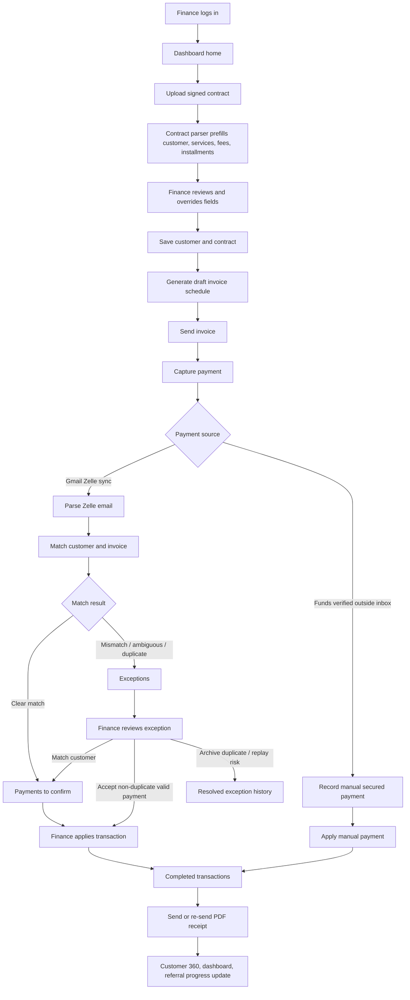
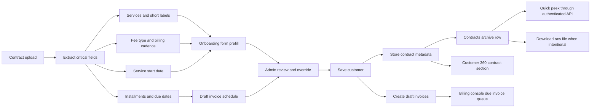
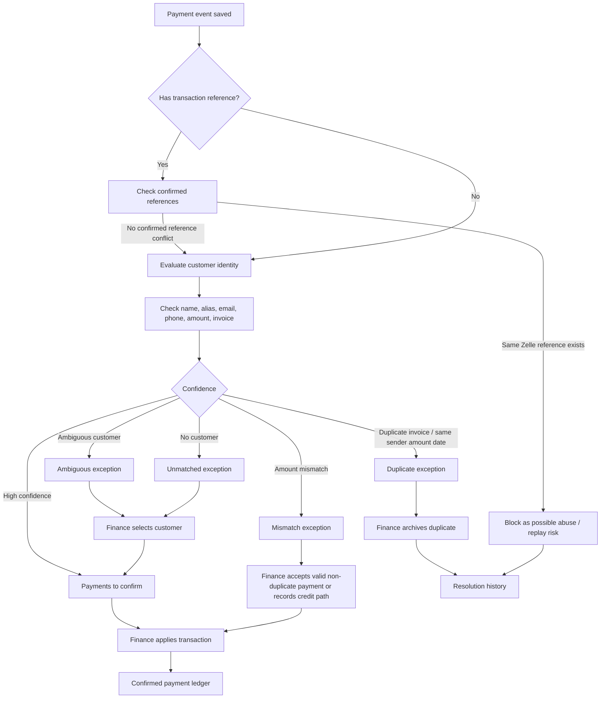
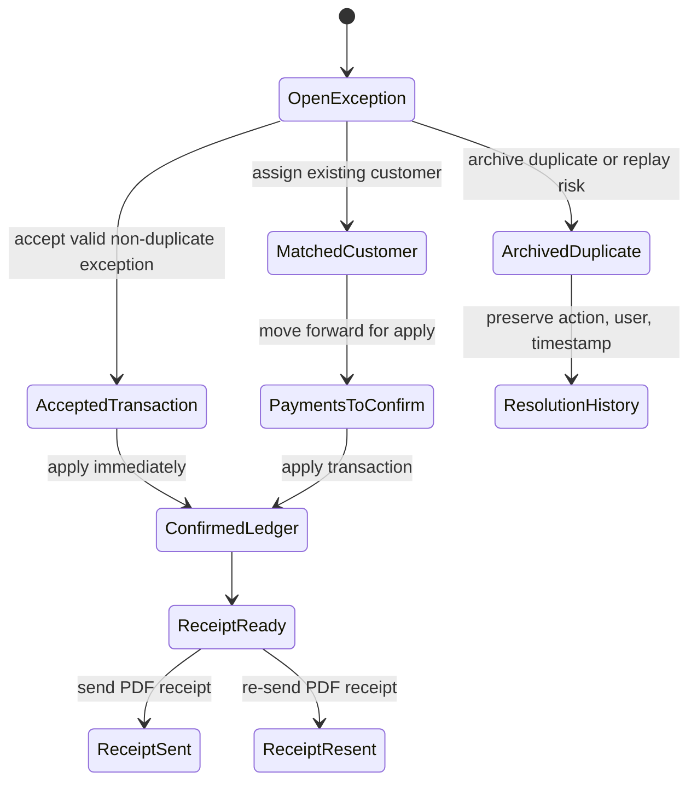
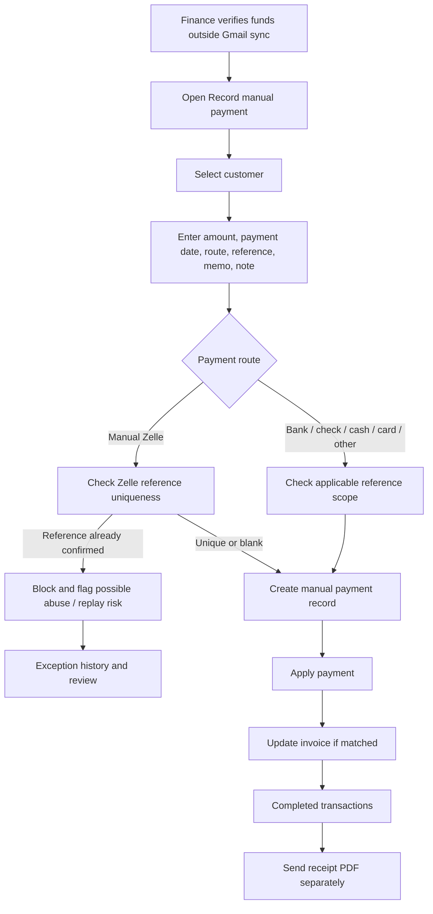
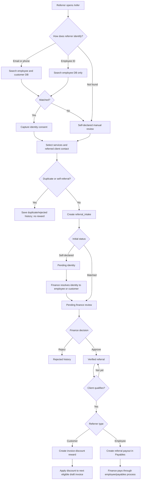
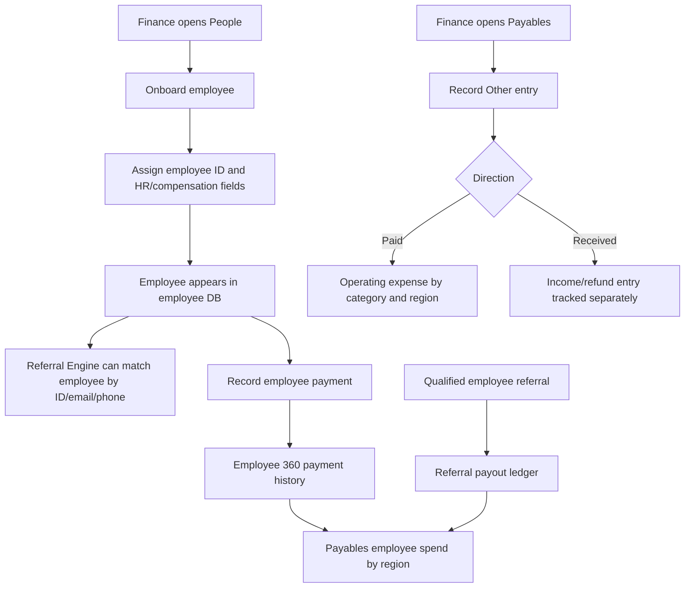
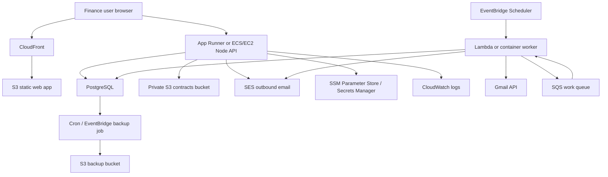

# Setu Finance Flow And Process Diagrams

This document collects the core process and system diagrams needed to explain Setu Finance to business, operations, and engineering teams.

## 1. Business User Flow

## 2. Contract-To-Invoice Process

## 3. Payment Matching Process

## 4. Exception Review Process

## 5. Manual Secured Payment Process

## 6. Referral Engine And Reward Routing Process

## 7. People And Payables Process

## 8. AWS User Flow And Service Touchpoints

## 9. Diagram Legend

| Component | One-line function |
| --- | --- |
| Finance user browser | Operator-facing entry point for onboarding, billing, payment review, receipts, settings, and reporting. |
| CloudFront | Global HTTPS edge layer for serving the React application quickly and securely. |
| S3 static web app | Low-cost storage for the compiled frontend bundle. |
| Node API | Express backend that enforces auth, business rules, payment application, receipt actions, and portal APIs. |
| PostgreSQL | System of record for customers, contracts, invoices, payments, exceptions, referrals, settings, and audit history. |
| Referral Engine | Public no-login referral intake and finance-admin approval gate before reward routing. |
| People ledger | Employee master data, status, compensation context, and payment history. |
| Payables ledger | Employee payments, employee referral payouts, other expenses paid, and other income/refund entries. |
| Private S3 contracts bucket | Secure encrypted storage for uploaded contract files by owner category, owner ID, and date. |
| SES | AWS-native outbound invoice and receipt email delivery. |
| SSM Parameter Store / Secrets Manager | Secure runtime storage for passwords, Gmail tokens, SMTP/SES credentials, and API secrets. |
| CloudWatch logs | Centralized application, worker, sync, and error logs. |
| EventBridge Scheduler | Runs Gmail sync and backup schedules without relying on a user click. |
| Lambda or container worker | Executes background sync, reconciliation, email jobs, and future bank integration tasks. |
| Gmail API | Reads Zelle confirmation messages from the configured mailbox. |
| SQS work queue | Decouples background work from user-facing API requests. |
| S3 backup bucket | Stores database backup snapshots with lifecycle transition to low-cost archive storage. |

## 10. Risk Controls

| Risk | Control |
| --- | --- |
| Same Zelle email synced twice | `processed_messages` prevents duplicate Gmail message processing. |
| Same Zelle transaction number replayed | Confirmed Zelle references are unique across Gmail and manual Zelle scopes. |
| Payment posted to wrong customer | Exceptions require human review and customer assignment before apply. |
| Manual payment entered without proof | Manual form captures route, reference, memo, and internal verification note. |
| Referral bonus paid incorrectly | Every Referral Engine submission requires finance approval before reward routing; customer rewards are invoice discounts and employee rewards route to Payables. |
| Employee payment not visible to finance | Employee payments are stored in `employee_payments` and roll up in People 360 plus Payables region reporting. |
| Other expense loses context | Other entries store category, direction, vendor/source, region, department, memo, reference, recording user, and exact cents. |
| Lost cloud data | PostgreSQL backups should run every 2 hours into private S3 with lifecycle policy. |
