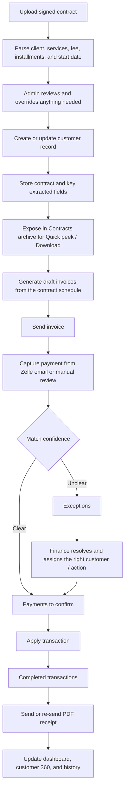

# Setu Finance Process Flow

This is the current business workflow for Setu Finance, written for operations and leadership teams.

For the expanded diagram pack covering business flow, contract-to-invoice, matching, exceptions, manual secured payments, referrals, and AWS user flow, see [flow-diagrams.md](flow-diagrams.md).

## Quick Business View

### In Plain English

- First upload the signed contract.
- Let Setu prefill services, fee, installments, and dates.
- Adjust anything manually if the contract needs a finance override.
- Save the client and the generated draft invoices.
- Then send the invoice.
- When money shows up, save it as a transaction record.
- If the portal is confident, finance applies it from `Payments to confirm`.
- If the portal is not confident, finance resolves it in `Exceptions`.
- After apply, the transaction stays in history and the receipt can be sent separately.

## End-to-End Flow

```mermaid
flowchart LR
    A["1. Upload signed contract"] --> B["Read key contract fields"]
    B --> C["Prefill customer profile + short-name services"]
    C --> D["Admin overrides or adds missing data"]
    D --> E["Create stable customer ID and searchable profile"]
    E --> F["Store contract file and parsed contract summary"]
    F --> G["Generate draft invoice schedule"]
    G --> H["Send invoice email"]
    H --> I{"How does payment appear?"}
    I -->|"Zelle email synced"| J["Capture structured transaction details from inbox"]
    I -->|"Manual awareness"| K["Finance reviews payment details manually"]
    J --> L["Matching engine identifies customer and invoice"]
    K --> M["Record secured manual payment"]
    L -->|"Clear match"| N["Payments to confirm"]
    L -->|"Mismatch / ambiguity / duplicate"| O["Exceptions queue"]
    M --> N
    O --> P{"Human exception decision"}
    P -->|"Match customer"| N
    P -->|"Accept valid payment"| Q
    P -->|"Archive duplicate"| X["Keep in resolved exception history without counting"]
    N --> Q["Human clicks Apply transaction"]
    Q --> R["Mark payment applied and update invoice / account state"]
    R --> S["Evaluate referral qualification and unlock reward if earned"]
    S --> T["Finance applies referral bonus to the next draft invoice as a discount"]
    T --> U["Move record to Completed transactions"]
    U --> V["Send or re-send PDF receipt to primary customer email"]
    V --> W["Update dashboard, customer 360, activity history, and referral progress"]
```

## What This Means Operationally

- Contract upload is the first step. Finance should start from the signed agreement before invoicing begins.
- Parsed contract details should prefill the client record, services, billing cadence, fee, installments, and service-start date wherever possible.
- Admins can manually override contract-derived values before the record is saved.
- Every service enrollment is timestamped so later add-on services remain historically traceable.
- Contract binaries and extracted critical fields stay linked to the customer record and are visible in customer 360 plus the Contracts archive.
- The Contracts archive shows signed-with party, compact summary, signed date, Quick peek, and Download without exposing internal storage details to operators.
- Synced Zelle emails are converted into durable transaction records with captured details such as amount, transaction number, memo, dates, source emails, and raw extracted text.
- The system does not auto-post money blindly. A human still decides when to apply a prepared transaction.
- Applying a payment and sending a receipt are now separate actions.
- Completed transactions stay visible after apply so finance can send or re-send a receipt later if needed.
- Receipts are sent as PDF attachments to the customer’s primary email on file.
- Referral progress and rewards update only after a payment has actually been applied.
- Qualified referral bonuses are not paid out as standalone credits. Finance applies them to the next eligible draft invoice so the customer simply sees a lower invoice amount.
- Special referral campaigns can raise or lower the bonus and qualification thresholds for future enrollments without corrupting historical relationships.

## Exception Paths

- If the payer identity is unclear, the transaction goes to `Exceptions`.
- If the amount does not match the expected invoice amount, the transaction goes to `Exceptions`.
- If the same payment appears twice, duplicate controls prevent it from being counted or applied twice.
- If the same Zelle transaction number appears again, the portal blocks it as a possible abuse/replay risk for bank-level verification.
- If finance confirms a non-duplicate exception is a valid payment, the `Accept transaction` action applies it and stores the decision in exception history.
- If funds are secured outside Gmail sync, finance can record a manual payment and then send the same PDF receipt from completed transactions.
- When finance resolves an exception, that decision stays in exception history with the resolution action, user, and timestamp.
- If no invoice exists yet, the payment can still be saved, reviewed, and linked later.
- If a client enrolls in more services later, onboarding adds new dated history instead of overwriting the original record.
